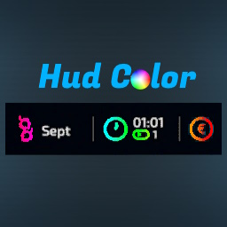
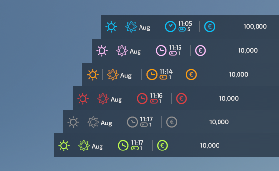

 

<h3 align="center"><u>FS22_HudColor</u></h3>

    With this mod you can change the color of the players-hud. There are a total of 6 colors to choose from. Choose one of: 
- Default (blue) 
- rose 
- orange 
- red 
- gray 
- green 
 

    

## Credits
* Danke an Iron_Thomas für die Idee 🙌

# Copyright
Copyright (c) 2024 [Dennis Schmitt](https://github.com/peppie84).
All rights reserved.

(<a href="#readme-top">back to top</a>)
